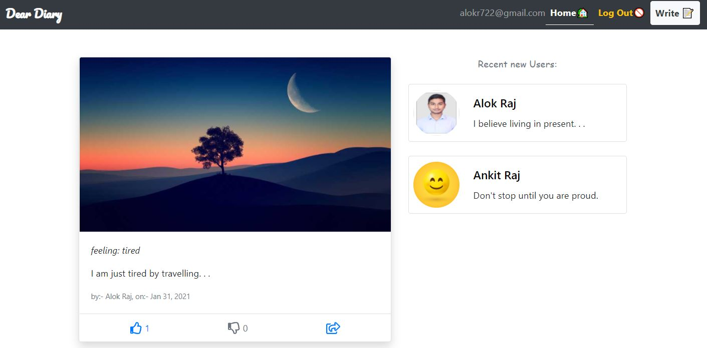

<h1 align="center">welcome to project: dear diary 👋</h1>
<p>
  
  
</p>

> a responsive angular webapp to share daily thoughts by sharing an image along with caption, like, dislike features and has been inspired by Instagram. Backend functionalities has been implemneted using firebase.

## 🏠 [Home](https://diaryentry722.web.app/)

## 📸 screenshot




## 🛠 usage

```sh
$ git clone https://github.com/alok722/angular-diary-entry.git

$ cd angular-diary-entry

$ npm i

$ npm run start
```

## 👤 author

 **Alok raj (alokr417@gmail.com)**

* website: https://alokraj.tech/
* github: [@alok722](https://github.com/alok722)
* linkedin: [@alok722](https://linkedin.com/in/alok722)


## 🤝 contributing

contributions, issues and feature requests are welcome!

## 🙌 show your support

give a ⭐️ if this project helped you!


***
